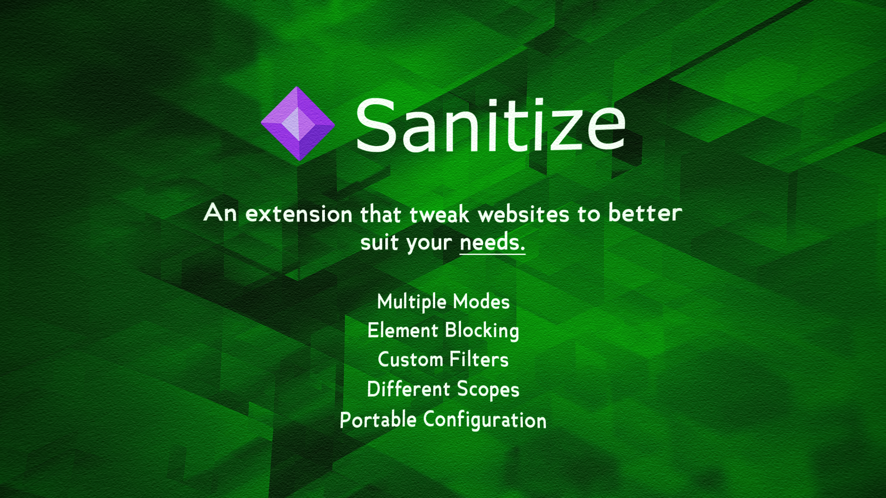

## Sanitize: Craft Your Ideal Browsing Experience

[Sanitize](https://redeemedspoon.github.io/Sanitize/) is a browser extension built with a simple philosophy: **give you the power to customize your browsing experience**. We believe in distraction-free focus and privacy. With Sanitize, you can transform the chaotic web into a streamlined environment that prioritizes your needs and boosts your productivity.

### Sanitize Features:

- **Zen Mode :** Enter a distraction-free, text-only view of the web.
- **Freeze Mode :** Block completely all interaction with the website and its content.
- **Grayscale Mode :** decolorize the website for a more comfortable black and white experience.
- **Blockable Annoyances :** Strip away elements that steal your attention like videos, images, etc...
- **Personal Filters :** Customize your browsing experience with Either HTML, CSS, or JavaScript filters.
- **Global/Local Scope :** Change scopes to apply settings and filters to the entire web or the current website.
- **Import/Export System :** Import and export between multiple devices with a simple JSON file.

### Available on All Major Browsers:

- Chrome
- Firefox
- Edge
- Opera

### Installation & How to Use:

Head over to our [Website](https://redeemedspoon.github.io/Sanitize/) to install the extension on your browser and get started with our small guide to give you to a brief introduction. For more detailed information, please feel free to explore other parts of our site, such as the FAQ section or the changelog.

### License:

Sanitize is licensed under the GNU General Public License v3.0 (GPLv3). This license grants you certain rights and freedoms when using Sanitize's code. You can learn more about the GPLv3 here: [License](./LICENSE).

### Contributing to Sanitize:

Whether you're a coding wiz or new to the scene, there are ways to get involved.

- Submit a proposal for a new feature in the issues section.
- Report bugs, preferably with some context in the issues section.
- Fork this repository, make your changes, and submitting a pull request.

### Write a Review:

If you enjoyed using Sanitize, please write a review and let us know what you think can be improved.

Together, let's build a better web. Let [Sanitize](https://redeemedspoon.github.io/Sanitize/) be your guide!
